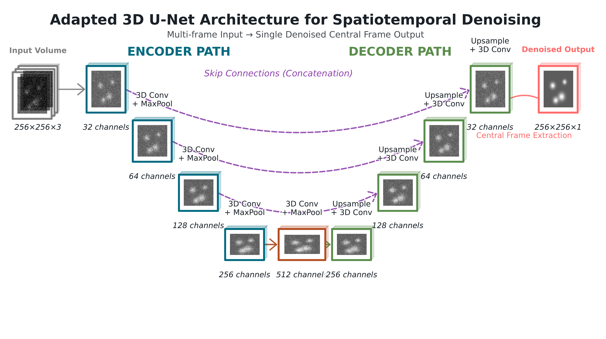
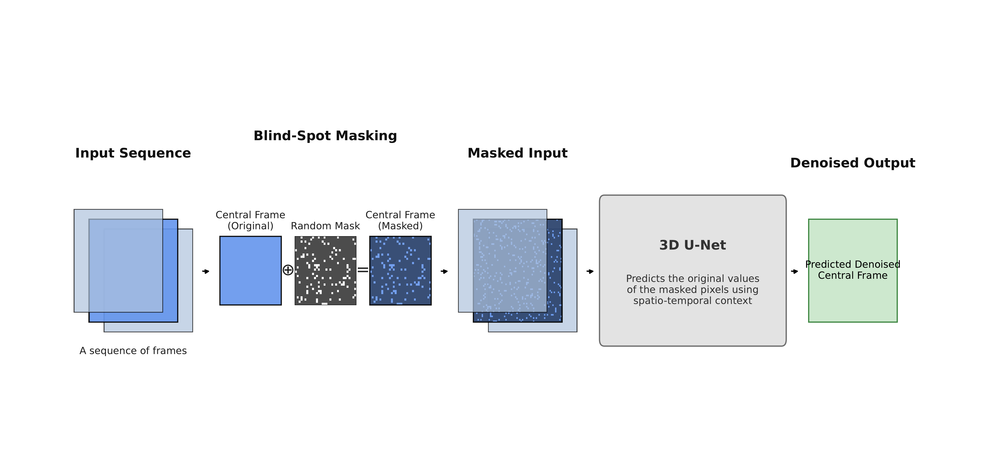

# Fidelity_Guided_Denoising_Approach

This repository provides the official implementation for the paper **Enhanced Quantitative Accuracy in Single Molecule Imaging: A Fidelity-Guided Denoising Approach**. Our work introduces a novel self-supervised denoising framework for single-molecule TIRF microscopy data, centered on a 3D U-Net trained with a composite loss function.

This framework is presented in two distinct approaches:
1.  **Static $\lambda$:** A 3D U-Net trained with a manually-tuned, static fidelity weight ($\lambda$).
2.  **Adaptive (RL) $\lambda$:** A 3D U-Net trained jointly with a reinforcement learning (RL) agent that dynamically selects the optimal $\lambda$ for each training batch.

[](https://link.to.paper)
[](https://opensource.org/licenses/MIT)

---

## Table of contents
- [Methodology Overview](#methodology-overview)
- [Installation](#installation)
- [Inference](#inference-using-a-pre-trained-model)
- [Training (Static-λ)](#training-static-λ)
- [Training (RL-controlled λ)](#training-rl-controlled-λ)
- [Troubleshooting & FAQ](#troubleshooting--faq)
- [Citing](#citing)

---
## Methodology Overview

Our denoising framework is built on three core components: a 3D U-Net architecture, a self-supervised training strategy, and a novel physics-informed loss function.

### 1. 3D U-Net Architecture
We use an adapted 3D U-Net to process spatiotemporal volumes of microscopy data (e.g., 256x256xT, where T is the number of frames). This allows the network to leverage both spatial and temporal context to reconstruct the central frame of the sequence.



### 2. Self-Supervised, Blind-Spot Training
Training is self-supervised, requiring no clean "ground truth" images. We adapt the blind-spot strategy by masking random pixels in the central frame of an input sequence. The network is then trained to predict the values of these masked pixels using only the surrounding spatial and temporal context.



### 3. Composite Physics-Informed Loss
The core of our method is a composite loss function that balances denoising and data fidelity. It is "physics-informed" because it incorporates the Poisson-Gaussian noise statistics of the EMCCD camera:

```math
\mathcal{L}_{\text{total}} = \mathcal{L}_{\text{NLL-masked}} + \lambda \cdot \mathcal{L}_{\text{MSE-unmasked}}
```

* **$\mathcal{L}_{\text{NLL-masked}}$**: A Poisson-Gaussian Negative Log-Likelihood loss calculated only at the masked pixels. This forces the network to learn a physically plausible reconstruction.
* **$\mathcal{L}_{\text{MSE-unmasked}}$**: A Mean Squared Error (MSE) fidelity term calculated only at the unmasked pixels. This penalizes the network for changing pixels it can see, preserving the original data structure.
* **$\lambda$**: A hyperparameter that balances the two loss terms. This repository provides code to train with a **static $\lambda$** (`train_static_lamda.py`) or an **adaptive $\lambda$** chosen by an RL agent (`train_lambda_RL.py`).

---

## Installation

1.  Clone this repository:
    ```bash
    git clone https://github.zhaw.ch/Bio-Hhost/Fidelity_Guided_Denoising_Approach.git
    cd Fidelity_Guided_Denoising_Approach
    ```

2.  Install the required Python packages.

    You can install the main dependencies manually:
    ```bash
    pip install numpy scipy opencv-python tifffile matplotlib pandas scikit-learn
    pip install tensorflow  # or tensorflow[and-cuda] depending on your setup
    ```
    > GPU highly recommended. If you use TensorFlow with GPU, install the matching CUDA/cuDNN per TensorFlow’s docs.
---


## Inference (Using a Pre-trained Model)

This is the fastest way to denoise your own data. You will first need to download our pre-trained models and associated files from [**link**].

### Approach 1: Static $\lambda$ Model

This model requires three files: the input video, the trained `.keras` model, and the `.npy` noise parameter file generated during training.

```bash
python inference_static_lambda.py \
    --input_file path_to_noisy_video.tif \
    --model_file path_to_pretrained_models.keras \
    --noise_params_file path_to_pretrained_models_noise_params.npy \
    --output_file path_to_denoised_video.tif \
    --sequence_length 1
```

  > --sequence_length: Must match the sequence length the model was trained with (e.g., 1, 3, or 5).

### Approach 2: Adaptive (RL) λ Model

This model only requires the input video and the folder containing the training run data (which includes the `config.json` and model weights). The RL agent is not used during inference; the U-Net is the final denoising model.

```bash
python inference_lambda_RL.py \
    --input_file path_to_noisy_video.tif \
    --model_folder path_to_pretrained_models/rl_run_folder/ \
    --output_file path_to_denoised_video.tif
```
> **Tip:** `sequence_length` used for inference must match training.

---

## Training (Static-λ)

**Script:** `train_static_lamda.py`

**Key ideas**
- Loads **one or more** multi-page TIFF stacks and concatenates frames.
- **Estimates noise parameters** if not provided:
  - Background level (median of user-defined noise regions)
  - Readout variance (MAD-based)
  - Gain α (slope of variance–mean relationship across patches)
- Builds a 3D U-Net with blind-spot masking on the central frame.
- Loss: **Poisson–Gaussian NLL on masked pixels + λ·MSE on unmasked pixels**.

**Most useful flags**
- `--input_files`: one or more training TIFFs (same pixel size)
- `--sequence_length`: odd (e.g., 1, 3, 5)  
- `--lambda_geo`: the fidelity weight `λ`
- `--background_level`, `--gaussian_variance`, `--gain_estimate`:
  provide **all three** to **skip** auto-estimation
- `--plot_noise`: saves quick-look plots for noise & gain estimation
- `--train_ratio/--val_ratio`: sequential split across frames

**Outputs**
- `--output_model` `.keras` file  
- `--output_history` `.npy` with training history  
- `--output_noise_params` `.npy` dict with `{background_level, gaussian_variance, gain_estimate}`

**Example (manual noise params)**
```bash
python train_static_lamda.py   --input_files data/highSNR_train_01.tif   --sequence_length 3   --lambda_geo 0.001   --background_level 198.0   --gaussian_variance 388.0   --gain_estimate 18.0   --output_model outputs/static_lambda/model.keras   --output_noise_params outputs/static_lambda/noise_parameters.npy
```

---

## Training (RL-controlled λ)

**Script:** `train_lambda_RL.py`

**What’s different**
- A DDPG agent picks `λ` in **[min, max]** per-batch (default `[0.01, 0.5]`).
- Rewards capture denoising gains and fidelity w.r.t. spot features (by default: **SNR-based reward** around TrackMate spots).
- Warm-up phase with random actions fills the replay buffer; then joint training starts.

**Inputs**
- `--tiff_path`: single training TIFF stack
- `--spots_csv_path`: TrackMate spot CSV for that movie
- `--sequence_length`: odd
- **Image size must match** your TIFF (`--img_height`, `--img_width`)
- `--base_output_path`: a folder where the run will be created:  
  `runs/training_run_YYYYMMDD-HHMMSS/`
  - Saves: `config.json`, `models/unet_final.keras` (and `*_best*.h5` weights), `training_history.csv`, and debug PNGs.

**Reward & state**
- Default reward (`calculate_snr_reward`) averages spot SNR improvements using small signal/background radii (configurable).
- State vector per batch: `[mean(frame), std(frame), #spots, mean SNR, mean QUALITY]`.

**Important flags (selection)**
- `--lambda_geo_bounds 0.01 0.5`
- `--total_epochs`, `--steps_per_epoch`, `--unet_batch_size`
- `--rl_warmup_epochs` (default 5)
- `--gamma`, `--tau`, `--actor_lr`, `--critic_lr`, `--unet_lr`
- Learning-rate scheduler and early stopping are built-in.

**Example RL-λ training with custom bounds & warm-up**
```bash
python train_lambda_RL.py   --tiff_path data/train_01.tif   --spots_csv_path data/train_01_trackmate.csv   --base_output_path runs   --sequence_length 5 --img_height 256 --img_width 256   --lambda_geo_bounds 0.01 0.5   --rl_warmup_epochs 5 --total_epochs 100 --steps_per_epoch 100
```

---

## Troubleshooting & FAQ

**My data aren’t 256×256.**  
- Static-λ: handled automatically.  
- RL-λ: set `--img_height`/`--img_width` to **match** your frames.

**OOM / GPU memory issues.**  
- Lower `--batch_size`, reduce `--sequence_length`, or crop ROIs.

**“sequence_length must be odd.”**  
- Use `1, 3, 5, ...`. Training and inference must **match**.

**Noise estimation looks off.**  
- Provide all three manually: `--background_level --gaussian_variance --gain_estimate`.  
- Or adjust the hard-coded noise regions in the scripts (four corners by default).

**Can I run per-frame denoising?**  
- Yes: set `--sequence_length 1` (still uses 3D layers but no temporal context).

---

## Citing

If you use this code, please cite the paper and this repository:

```bibtex
@article{abc,
  title   = {...},
  author  = {...},
  journal = {...},
  year    = {...},
  note    = {Code: https://github.zhaw.ch/Bio-Hhost/Fidelity_Guided_Denoising_Approach}
}
```

---

