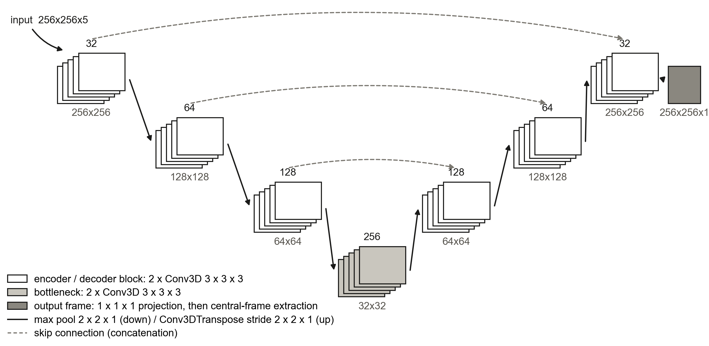
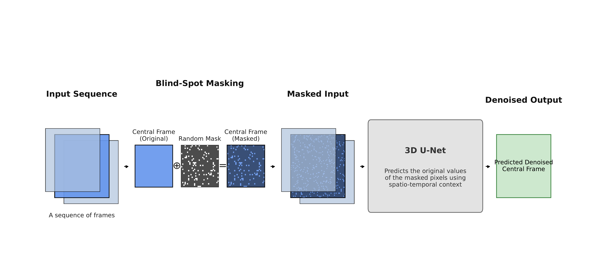

# Fidelity_Guided_Denoising_Approach

This repository provides the official implementation for the paper **Enhanced Quantitative Accuracy in Single Molecule Imaging: A Fidelity-Guided Denoising Approach**. Our work introduces a novel self-supervised denoising framework for single-molecule TIRF microscopy data, centered on a 3D U-Net trained with a composite loss function.

This framework is presented in two distinct approaches:
1.  **Static $\lambda$:** A 3D U-Net trained with a manually-tuned, static fidelity weight ($\lambda$).
2.  **Automatically tuned (RL) $\lambda$:** A 3D U-Net trained jointly with a reinforcement learning (RL) agent that selects $\lambda$ from the data during training, removing the manual hyperparameter search. The learned policy converges to a single global value rather than varying per batch — see [Training (RL-controlled λ)](#training-rl-controlled-λ).

[](https://link.to.paper)
[](https://opensource.org/licenses/MIT)

---

## Table of contents
- [Methodology Overview](#methodology-overview)
- [Installation](#installation)
- [Inference](#inference-using-a-pre-trained-model)
- [Example data / smoke test](example_data/README.md)
- [Training (Static-λ)](#training-static-λ)
- [Training (RL-controlled λ)](#training-rl-controlled-λ)
- [Repository layout](#repository-layout)
- [Which models are included](#which-models-are-included)
- [Evaluation](#evaluation)
- [Figures](#figures)
- [Troubleshooting & FAQ](#troubleshooting--faq)

---
## Methodology Overview

Our denoising framework is built on three core components: a 3D U-Net architecture, a self-supervised training strategy, and a novel physics-informed loss function.

### 1. 3D U-Net Architecture
We use an adapted 3D U-Net to process spatiotemporal volumes of microscopy data (e.g., 256x256xT, where T is the number of frames). This allows the network to leverage both spatial and temporal context to reconstruct the central frame of the sequence.



### 2. Self-Supervised, Blind-Spot Training
Training is self-supervised, requiring no clean "ground truth" images. We adapt the blind-spot strategy by masking random pixels in the central frame of an input sequence. The network is then trained to predict the values of these masked pixels using only the surrounding spatial and temporal context.



### 3. Composite Physics-Informed Loss
The core of our method is a composite loss function that balances denoising and data fidelity. It is "physics-informed" because it incorporates the Poisson-Gaussian noise statistics of the EMCCD camera:

```math
\mathcal{L}_{\text{total}} = \mathcal{L}_{\text{NLL-masked}} + \lambda \cdot \mathcal{L}_{\text{MSE-unmasked}}
```

* **$\mathcal{L}_{\text{NLL-masked}}$**: A Poisson-Gaussian Negative Log-Likelihood loss calculated only at the masked pixels. This forces the network to learn a physically plausible reconstruction.
* **$\mathcal{L}_{\text{MSE-unmasked}}$**: A Mean Squared Error (MSE) fidelity term calculated only at the unmasked pixels. This penalizes the network for changing pixels it can see, preserving the original data structure.
* **$\lambda$**: A hyperparameter that balances the two loss terms. This repository provides code to train with a **static $\lambda$** (`train_static_lambda.py`) or an **automatically tuned $\lambda$** chosen by an RL agent (`train_lambda_RL.py`).

---

## Installation

1.  Clone this repository:
    ```bash
    git clone https://github.com/Bio-Hhost/Fidelity_Guided_Denoising_Approach.git
    cd Fidelity_Guided_Denoising_Approach
    ```

2.  Install the required Python packages.

    **Recommended — pinned versions**, reproducing the environment the paper's results were
    produced in:
    ```bash
    pip install -r Requirements.txt
    ```

    Or install the main dependencies manually:
    ```bash
    pip install numpy scipy opencv-python tifffile matplotlib pandas scikit-learn
    pip install tensorflow  # or tensorflow[and-cuda] depending on your setup
    ```
    > GPU highly recommended. If you use TensorFlow with GPU, install the matching CUDA/cuDNN per TensorFlow’s docs.

3.  Verify the installation with the runnable example in
    [`example_data/`](example_data/README.md), which contains a small demo stack and verified
    commands for both the static-λ and automatically tuned inference pipelines.
---


## Inference (Using a Pre-trained Model)

This is the fastest way to denoise your own data. You will first need to download our pre-trained
models and associated files from the archived record: `<MODEL_DOWNLOAD_LINK>`.

The archive contains the four static-λ models, the automatically tuned (RL) model, and the
configuration files each pipeline needs. To verify a working installation before using your own data,
run the smoke test in [`example_data/`](example_data/README.md), which provides a small demo stack and
verified commands for both pipelines.

### Approach 1: Static $\lambda$ Model

This model requires three files: the input video, the trained `.keras` model, and the `.npy` noise parameter file generated during training.

```bash
python inference_static_lambda.py \
    --input_file path_to_noisy_video.tif \
    --model_file path_to_pretrained_models.keras \
    --noise_params_file path_to_pretrained_models_noise_params.npy \
    --output_file path_to_denoised_video.tif \
    --sequence_length 1
```

  > --sequence_length: Must match the sequence length the model was trained with (e.g., 1, 3, or 5).

### Approach 2: Automatically Tuned (RL) λ Model

This model only requires the input video and the folder containing the training run data (which includes the `config.json` and model weights). The RL agent is not used during inference; the U-Net is the final denoising model.

```bash
python inference_lambda_RL.py \
    --input_file path_to_noisy_video.tif \
    --model_folder path_to_pretrained_models/rl_run_folder/ \
    --output_file path_to_denoised_video.tif
```
> **Tip:** `sequence_length` used for inference must match training.

---

## Training (Static-λ)
This mode is for the “normal” case: you pick a single fidelity weight `λ`, train the 3D U-Net once, and get a model you can run on all similar datasets.

### What the script does
`train_static_lambda.py` will:

1. load one or more multi-page TIFF files,
2. estimate the camera noise parameters from background regions (unless you provide them),
3. build the 3D U-Net with blind-spot masking on the central frame,
4. train it with the composite loss  
5. save the model, the training history, and the estimated noise parameters.

After one run you already have everything you need for inference.

### When to use it
- You have one stable acquisition setup (same TIRF/camera settings).
- You want to reproduce the paper without the RL part.
- You want to try a few λ values (e.g. `0`, `0.001`, `0.1`) and pick the best-looking one.

**Most useful flags**
- `--input_files`: one or more training TIFFs (same pixel size)
- `--sequence_length`: odd (e.g., 1, 3, 5)  
- `--lambda_geo`: the fidelity weight `λ`
- `--background_level`, `--gaussian_variance`, `--gain_estimate`:
  provide all three to skip auto-estimation
- `--plot_noise`: saves quick-look plots for noise & gain estimation
- `--train_ratio/--val_ratio`: sequential split across frames

**Outputs**
- `--output_model` `.keras` file  
- `--output_history` `.npy` with training history  
- `--output_noise_params` `.npy` dict with `{background_level, gaussian_variance, gain_estimate}`

**Minimum example**
```bash
python train_static_lambda.py   --input_files data/highSNR_train_01.tif   --sequence_length 3   --lambda_geo 0.1   --output_model outputs/static_lambda/model.keras   --output_noise_params outputs/static_lambda/noise_params.npy
```

**Example (manual noise params)**
```bash
python train_static_lambda.py   --input_files data/highSNR_train_01.tif   --sequence_length 3   --lambda_geo 0.001   --background_level 198.0   --gaussian_variance 316.53   --gain_estimate 17.689   --output_model outputs/static_lambda/model.keras   --output_noise_params outputs/static_lambda/noise_parameters.npy
```

The three values above are the ones the models in this paper were trained with, estimated from our
Cy3 recording: offset 198.0 ADU, read-noise variance 316.53 ADU² (σ 17.79 ADU, from a
median-absolute-deviation estimate on background regions) and gain 17.689 ADU/photon (slope of the
per-patch variance-versus-mean regression). **Use your own detector's values for your own data** —
omit all three flags and the script estimates them for you.

You can now call `inference_static_lambda.py` with these files.

---

## Training (RL-controlled λ)

This mode is the **automatically tuned** variant: instead of fixing `λ` before training, a DDPG agent selects it from the data during training, removing the manual hyperparameter search. The agent observes per-batch features (spot density, SNR, brightness) and emits a continuous `λ` within the bounds `[0.01, 0.5]`.

### What the script does
`train_lambda_RL.py` ties together:

1. your training TIFF movie,
2. your TrackMate spot CSV,
3. a 3D U-Net,
4. a DDPG agent that proposes a `λ` inside a range (e.g. 0.01–0.5).

For each step:
- the agent proposes a `λ`,
- the U-Net trains on that batch with this `λ`,
- the script measures how good the result is around real spots (SNR-based reward),
- the agent updates so it can pick better `λ` next time.

Over training the agent converges on a single `λ` for the dataset. On our data it reaches the upper
bound of the permitted range (`λ → 0.5`) within about two main-loop epochs and stays there, so the
practical benefit is that you do not grid-search `λ` yourself.

### When to use it
- You do not want to grid-search `λ` by hand — each candidate value otherwise costs a full U-Net training run.
- You want to match the automatically tuned fidelity approach from the paper.
- You already have (or can export) TrackMate detections.

**Important flags (selection)**
- `--lambda_geo_bounds 0.01 0.5`
- `--total_epochs`, `--steps_per_epoch`, `--unet_batch_size`
- `--rl_warmup_epochs` (default 5)
- `--gamma`, `--tau`, `--actor_lr`, `--critic_lr`, `--unet_lr`
- Learning-rate scheduler and early stopping are built-in.

**Minimum example**
```bash
python train_lambda_RL.py   --tiff_path data/highSNR_train_01.tif   --spots_csv_path data/highSNR_train_01_trackmate.csv   --base_output_path runs   --sequence_length 5   --img_height 256 --img_width 256
```

**Example RL-λ training with custom bounds & warm-up**
```bash
python train_lambda_RL.py   --tiff_path data/train_01.tif   --spots_csv_path data/train_01_trackmate.csv   --base_output_path runs   --sequence_length 5 --img_height 256 --img_width 256   --lambda_geo_bounds 0.01 0.5   --rl_warmup_epochs 5 --total_epochs 100 --steps_per_epoch 100
```

This creates a timestamped folder in `runs/` (e.g. `runs/training_run_2025xxxx-xxxxxx/`) containing:
- `config.json`
- `models/` with the trained U-Net
- `training_history.csv`
- debug images

Exactly this folder is what `inference_lambda_RL.py` expects.

---

---

## Repository layout

```
train_static_lambda.py            train the U-Net at a fixed fidelity weight
train_lambda_RL.py                train the U-Net jointly with the DDPG agent
train_lambda_RL_lambda_frozen.py  the frozen-weight control used in the supplement
inference_static_lambda.py        denoise with a static-λ model
inference_lambda_RL.py            denoise with the automatically tuned model

simulated_data/                   build the simulated ground truth and add noise to it
evaluation/                       detection, localization and photometry evaluation
figures/                          the scripts that draw the paper's figures
comp_methods/                     the N2V / PN2V / PPN2V / DeepCAD-RT comparator notebooks
example_data/                     a 30-frame demo stack and verified commands (smoke test)

Data/                             the acquisitions and simulations the paper uses
trained_models/                   the models the paper reports
```

`Data/` and `trained_models/` are distributed through Zenodo, not through git. Unpack them into the repository root so the paths above resolve.

`crb.py`, `mle_fit.py`, `run_r11.py` and `aggregate_r11.py` sit at the root and belong to the
localization analysis: a Poisson-Gaussian maximum-likelihood fitter, the Cramér-Rao bound it is
compared against, and the driver that produces the per-cell tables behind the supplementary
localization figures.

## Which models are included

`trained_models/` holds what the paper reports:

| directory | what it is |
| --- | --- |
| `rl_models_gain17689/` | the automatically tuned model and the two fixed-weight controls (T = 5 and T = 1) |
| `static_models_new/` | the four static models, λ ∈ {0.001, 0.1} × T ∈ {1, 3} |
| `N2V_model/`, `PN2V_model/`, `PPN2V_model/`, `DeepCAD_model/` | the comparators |
| `batch_logs/` | the per-epoch training logs behind the training-curve figure |


## Troubleshooting & FAQ

**My data aren’t 256×256.**  
- Static-λ: handled automatically.  
- RL-λ: set `--img_height`/`--img_width` to **match** your frames.

**OOM / GPU memory issues.**  
- Lower `--batch_size`, reduce `--sequence_length`, or crop ROIs.

**“sequence_length must be odd.”**  
- Use `1, 3, 5, ...`. Training and inference must **match**.

**Noise estimation looks off.**  
- Provide all three manually: `--background_level --gaussian_variance --gain_estimate`.  
- Or adjust the hard-coded noise regions in the scripts (four corners by default).

**Can I run per-frame denoising?**  
- Yes: set `--sequence_length 1` (still uses 3D layers but no temporal context).

<!--
---

## Citing

If you use this code, please cite the paper and this repository:

```bibtex
@article{abc,
  title   = {...},
  author  = {...},
  journal = {...},
  year    = {...},
  note    = {Code: https://github.com/Bio-Hhost/Fidelity_Guided_Denoising_Approach.git}
}
```

---
-->
